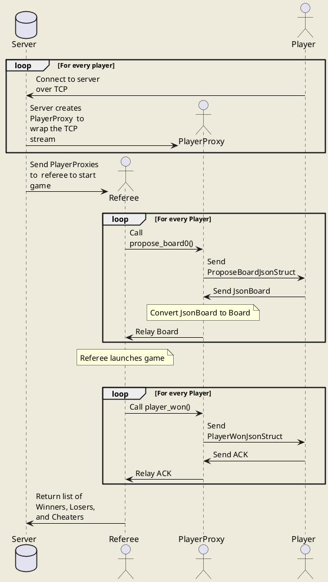

```plantuml
@startuml
    skinparam backgroundColor #EEEBDC
    skinparam handwritten false
    skinparam maxMessageSize 120
    database Server
    actor Referee
    actor PlayerProxy
    actor Player
    loop For every player
    Player -> Server: Connect to server over TCP

    Server -> PlayerProxy ** : Server creates PlayerProxy  to wrap the TCP stream
    end
    Server -> Referee **: Send PlayerProxies to  referee to start game
    loop For every Player
    Referee -> PlayerProxy: Call propose_board0()
    PlayerProxy -> Player: Send ProposeBoardJsonStruct
    Player -> PlayerProxy: Send JsonBoard
    note over PlayerProxy: Convert JsonBoard to Board
    PlayerProxy -> Referee: Relay Board
    end
    Note over Referee: Referee launches game
    |||
    
    loop For every Player
    Referee -> PlayerProxy: Call player_won()
    PlayerProxy -> Player: Send PlayerWonJsonStruct
    Player -> PlayerProxy: Send ACK
    PlayerProxy -> Referee: Relay ACK
    end

    Referee -> Server: Return list of Winners, Losers, and Cheaters
@enduml
```