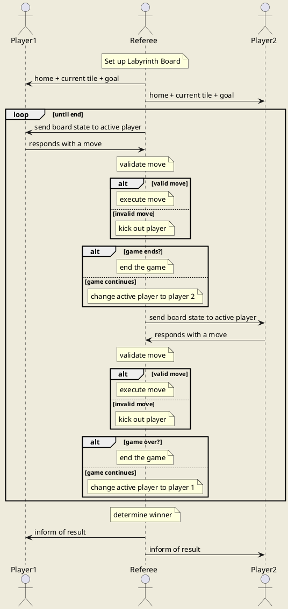

```plantuml
@startuml
    skinparam backgroundColor #EEEBDC
    skinparam handwritten false
    actor Player1
    actor Referee
    actor Player2
    note over Referee : Set up Labyrinth Board
    Referee -> Player1 : home + current tile + goal
    Referee -> Player2 : home + current tile + goal

    loop until end
        Referee -> Player1 : send board state to active player
        Player1 -> Referee : responds with a move
        note over Referee : validate move

        alt valid move
            note over Referee : execute move
        else invalid move
            note over Referee : kick out player 
        end

        alt game ends?
            note over Referee: end the game
        else game continues
            note over Referee : change active player to player 2
        end
        
        Referee -> Player2 : send board state to active player
        Player2 -> Referee : responds with a move
        note over Referee : validate move

        alt valid move
            note over Referee : execute move
        else invalid move
            note over Referee : kick out player 
        end

        alt game over?
            note over Referee: end the game
        else game continues 
            note over Referee : change active player to player 1
        end
    end

    note over Referee : determine winner
    Referee -> Player1 : inform of result
    Referee -> Player2 : inform of result
@enduml
```