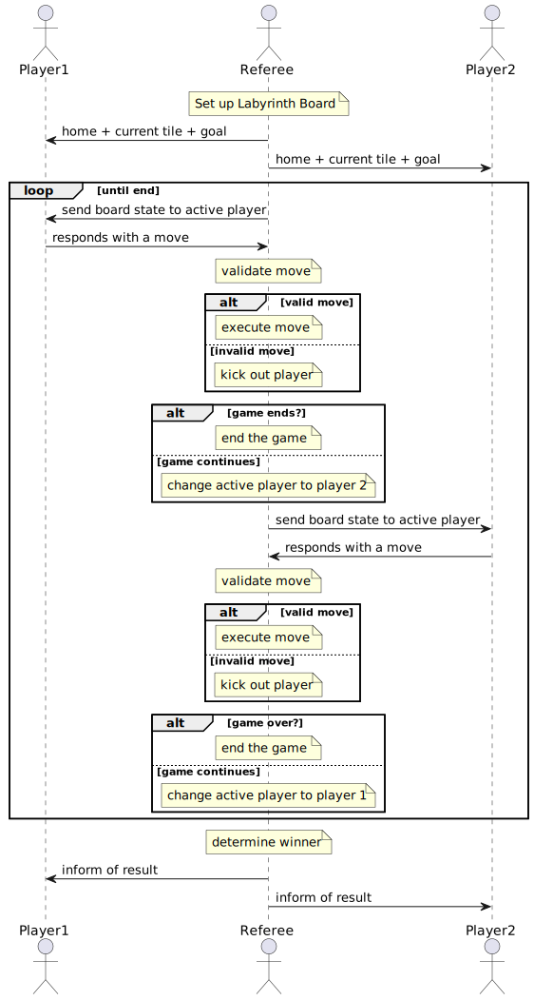

TO: CEO Santa Claus  
FROM: Luis Soto and Sahana Tankala  
DATE: October 20th, 2022  
SUBJECT: Player-Referee Protocol

# Player Referee Protocol

## Setting up the Game  
When started by the Game Server, the `Referee` sets up the `State` in an initial state, containing all the active players. This initial state does a few things:  
- Sets of the `Board` with assortment of `Tile`s.
- Assigns all players a home tile and a goal (an unordered pair of `Gems`)
- Sets all `Player`'s current tile to be their home tile.

Once setup is complete, the `Referee` sends each `Player` their assigned home
tile, goal, and their current position. The home and current tile for other
`Player`s is stored in the board state that is sent to a `Player` at the start
of its turn.

## Cause to kick out a Player  
A `Player` will be kicked out of the game by the `Referee` if the `Player` does any of the following:
- Makes an invalid move
  - Undoing a slide
  - Attempting to slide an immovable row / column.
  - Attempting to move to the same spot
  - Requesting a slide that would leave it with no possible moves
  - Attempts to make a move when it is not that `Player`s turn
- Takes too long to respond to the `Referee`

## Ending the game  
The `Referee` will end the game if one of two events occur:  
1. A player reaches their goal tile and then reaches their home tile. That `Player` wins the game.
2. All `Player`s in the game choose to `Pass` when the `Referee` requests a move. The game ends in a loss for all  `Player`s.

## Sequence Diagram for Player-Referee Protocol

