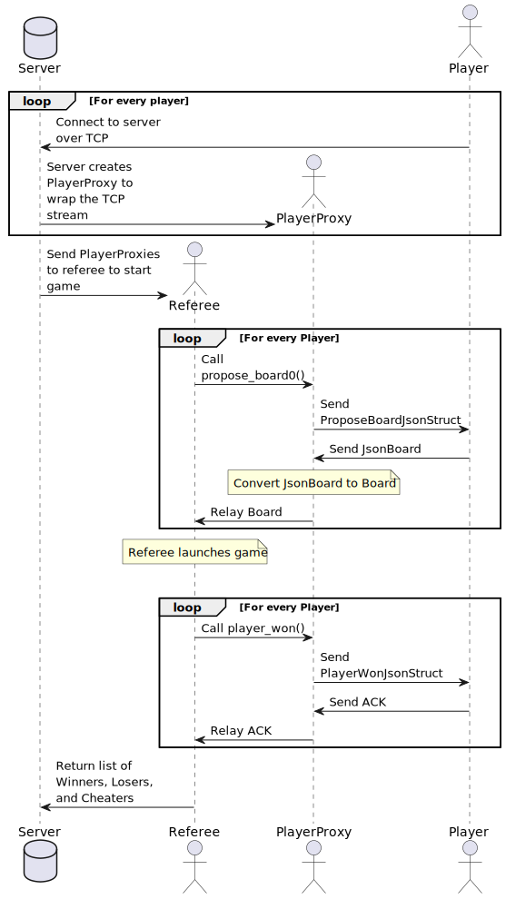

TO: CEO Santa Claus  
FROM: Luis Soto and Sahana Tankala  
DATE: October 31th, 2022  
SUBJECT: Remote Player Proxy

# Remote Player Proxy

## Proxy `JSON` Representations
Calling a method on a player over the network requires the remote player to
know what the method is to know how to respond. Therefore every method will
have a `JSON` representation with the arguments to the method inside the `JSON`
object.

## TCP management
The server will bind to a specific port to listen over TCP. Players will
connect to that port, generating `TCPStreams` on either end of the connection.
On the server side, a `PlayerProxy` will be created to wrap this `TCPStream`.
Then the server will create a referee and give it the `PlayerProxy`s to start a
game.

All players that timed-out or cheated are reported back to the server so that
the server does not attempt to keep using the player for more games.

